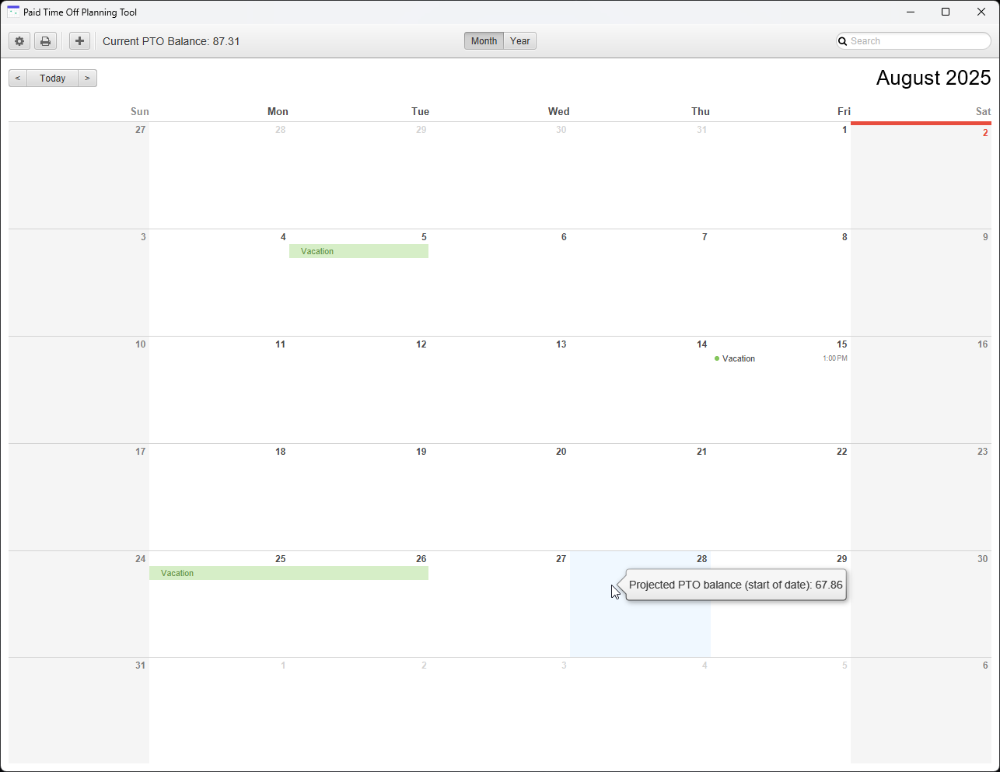

# Paid Time Off Calculator

## Demo

## Installation

1. Install [JDK](https://www.oracle.com/java/technologies/downloads/) (make sure its in your `PATH`).
2. Install [Maven](https://maven.apache.org/download.cgi) (make sure its in your `PATH`).
3. Run `mvn mvn javafx:run` to start the GUI application.
4. Run `mvn test` to test the program.

## Building Instructions

1. Install [Wix](https://github.com/wixtoolset/wix/releases/).
2. Download the [JavaFX SDK](https://gluonhq.com/products/javafx/).
3. Run `mvn clean package` to create a JAR file of the program.
4. Run `java --module-path "C:\path\to\javafx" --add-modules javafx.controls,javafx.fxml -jar target\pto-calculator-1.0-jar-with-dependencies.jar` to run the app.
